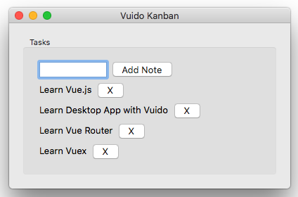

# vue-kanban

> Vue Kanban Desktop App With [Vuido](https://vuido.mimec.org/)



## Build Setup

``` bash
# install dependencies
npm install

# build
npm run build

# run the bundled script
npm start
```

For detailed explanation on how things work, consult the [Vuido documentation](https://vuido.mimec.org/).
